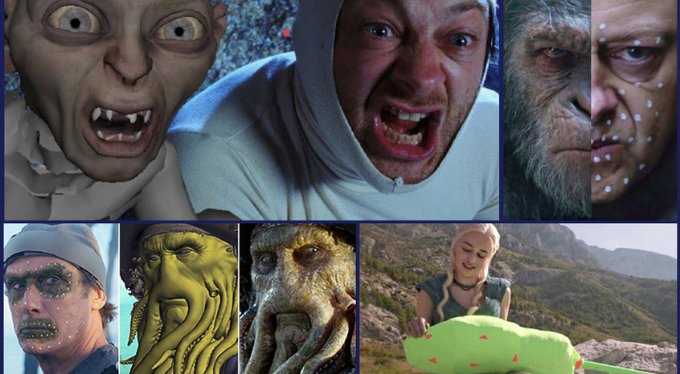
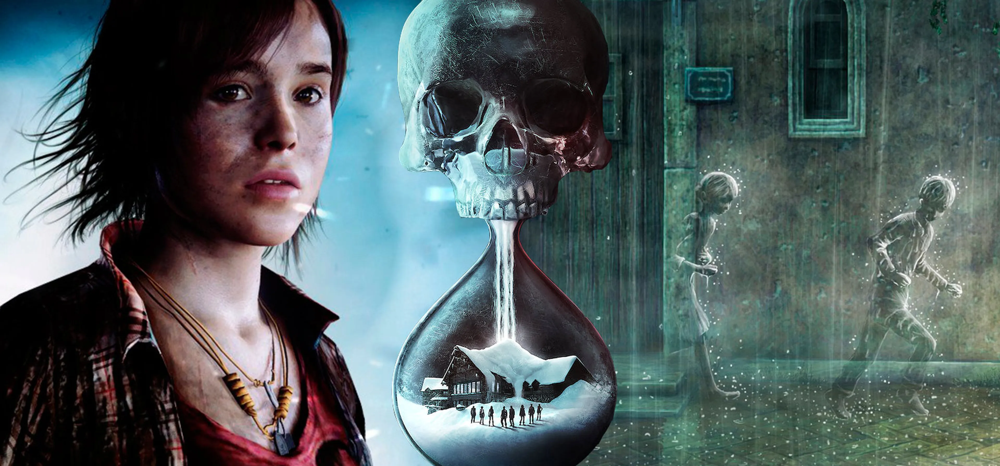

# PAC3_Manovich-Reloaded

Autor:Ismael Faiz Rzonca

Assignatura: Cultura Digital - Aula 1 -UOC

## Plantejament

Aquest projecte explorarà un concepte principal del teóric Lev Manovich, **la hibridació**, un pensament clau per entendre els canvis i el desenvolupament de la cultura digital que estem tenint en l'epoca contemporànea, aquesta tesis la presenta en el seu llibre "El software toma el mando". Es fruit d'aquest pensament que ara podem gaudir de millores innovadores en el món programari, sobretot en la multimèdia.
Per veure amb deteniment i analitzarlo correctament he escollit dos exemples de la hibridació: el CGI, l'eina que permet desenvolupar lo real amb lo fictici, i els videojocs narratius.

## 1º Exemple: CGI

### Descripció

Què és el CGI? El CGI (Computer Generated Imagery) es refereix a la creació d'imatges mitjançant software de computadora. El seu ús s'ha extés en el cine, la televisió, publicitat, videojocs i art digital.

### Hibridació i Manovich

Quina relació té amb l'hibridació què exposa Manovich? El CGI exposa una hibridació entre la narrativa visual tradicional com és el cine, l'animació clàsica, i tot el què és relacionat amb l'art del cinema, i la tecnologia digital, ja que intervé el software de modelatge, el renderitzat 3d, motors gràfics, etc. Aquesta combinació no només permet noves formes de representació, sinó que també transforma els procesos creatius i productius. Amb això es pot crear entorns, personatges i efectes completament digitals que coexisteixen amb imatges captades del món real. Un exemple es Piratas del Caribe, de Gore Verbinski, on l'actuació humana va ser registrada mitjançant captura de movimient i posteriorment convertida en animació digital. Aquesta tècnica va permetre crear un univer visual complexe que combina elements del cine tradicional, com es el cine de pirateria. amb el poder expresiu de la tecnologia 3D, per crear com per exemple el pop humà "Davy Jones".
Desde la perspectiva de Manovich, aquesta pràctica representa la convergencia entre medis audiovisuals clàsic i les posibilitats infinites del software. En lloc de eliminar lo anterior, lo digital absorbeix i ho transforma, generant productes culturals que no perteneixen a una única eina, sinó que la combinació de ambdúes.

### Conclusió

EL CGI no només és una peça atractiva que ha fet que l'art del cinema hagi crescut, sinó que ha fet que el cinema clàsic hagi pogut coexistir amb "ell", a més a més s'ha transmitit per l'entorn de la publciitat i la televisió, es a dir, ara és una eina clau que fa servir qualsevol en el món de la multimedia cinematogràfica i televisiva.

## 2º Exemple: Videojocs interactius

### Descripció

Què són els videojocs interactius? Un videojoc interactiu és un tipus de videojoc en el que el jugador té una participació activa i directa en el desenvolupament de la història o l'experiència del joc, prenent decision que poden afectar el curs dels events, personatges o desenllaç.

### Hibridació i Manovich

Quina relació té amb l'hibridació què exposa Monvovich? Els videojocs interactius, com per exemple "Unti Dawn", desenvolupat per Sony Computer Games i Supermassive Games, narran una història lineal tradicional qué és transforma en una experiència interactiva e inmersiva, on el jugador asumeix el rol actiu com coautor de la història. A través de decisions, en aquest cas, morals, exploració i diàlegs ramificats, es construeix múltiples línias argumantals que desemboquen en finals distints. En aquest exemple, l'hibridació no és només tecnológic, sinó que també narratiu i experimentatiu. Es combinen els codis del cine amb la mecànica dels videojocs. Com diu Manovich, l'usuari dels nous medis deixa de ser receptor pasiu per transformarse en un subjecte que intervé, decideix i modifica.

### Conclusió

Amb aquest innovador tipus de videojoc, l'interactiu, ha fet que el món del videojoc tingui una audiència més extensa per aquesta novetat i a la vegada, què l'era digital tingui una branca que representa la convergencia, la participació i l'expansió dels llenguatges expresius.
Aquest exemple busca no només identificar aquesta forma d'hibridació, si no què també reflexionar la nostra manera de veure les coses, narrar e intervenir en les historias del present.

## Referéncies i Bibliografia

MANOVICH, Lev. "El Software toma el mando." [En castellà] Barcelona: Editorial UOC, 2013. ISBN: 978-84-9064-022-7.

¿Qué es la animación con CGI y cómo funciona? - Disponible a:https://udit.es/actualidad/que-es-la-animacion-con-cgi-y-como-funciona/

Entretenimiento interactivo - Disponbiel a:https://es.wikipedia.org/wiki/Entretenimiento_interactivo
